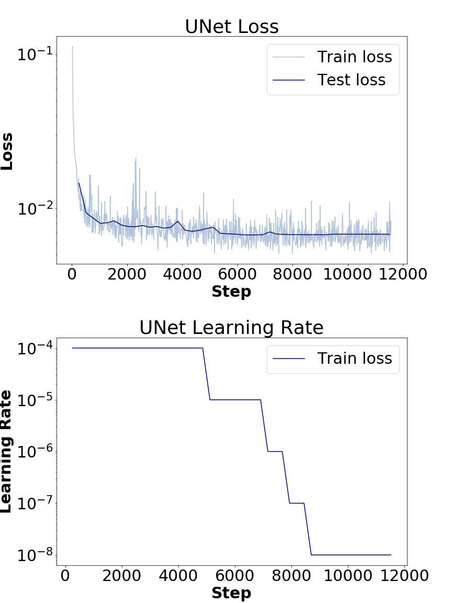

# Multiple Surface Segmentation of the Retinal Layer in OCT Images

# Data
Preprocessed data for this experiment were provided by Charit´e University Hospital Berlin.  
Data consist of the images of 53 healthy eyes. Each eye contains 47-49 scans (images) which makes 2597 images in total. 
We are not allowed to upload data and use outside of the class. 

# Methods
We have compared 2 methods, which were proposed for medical image segmentation, namely UNet and CNN-S.  
UNet code was forked from https://github.com/milesial/Pytorch-UNet

# Results:

UNet:  

  

# Authors
Arslan Gait - Computer Science, Nazarbayev University, arslan.gait@nu.edu.kz 
Aldiyar Bolatov - Department of Electrical and Computer Engineering, Nazarbayev University, aldiyar.bolatov@nu.edu.kz 
Aslan Ubingazhibov - Computer Science, Nazarbayev University, aslan.ubinagzhibov@nu.edu.kz  
Islambek Temirbek - Department of Electrical and Computer Engineering, Nazarbayev University,islambek.temirbek@nu.edu.kz 

# Reference
Shah, Abhay, et al. "Multiple surface segmentation using convolution neural nets: application to retinal layer segmentation in OCT images." Biomedical optics express 9.9 (2018): 4509-4526. 
Ronneberger, Olaf, Philipp Fischer, and Thomas Brox. "U-net: Convolutional networks for biomedical image segmentation." International Conference on Medical image computing and computer-assisted intervention. Springer, Cham, 2015.
